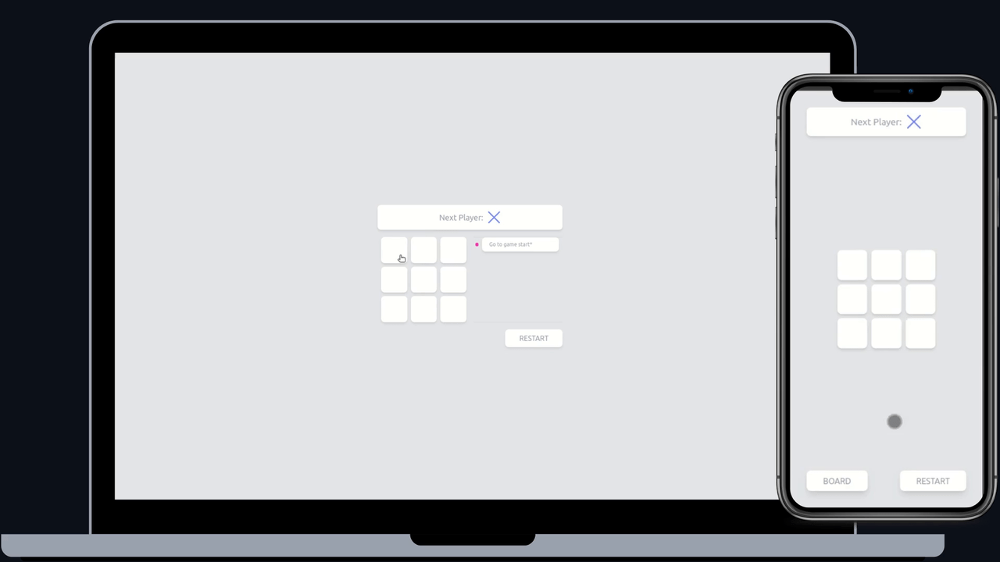

<div align="center">
    
</div>

<h1 align="left">Tic-tac-toe</h1>

<p align="left">
   <a href="https://github.com/danieljpgo">
      
   </a>
   
   <a href="https://github.com/danieljpgo/tic-tac-toe/graphs/contributors">
      
   </a>
   <a href="https://github.com/danieljpgo/tic-tac-toe/network/members">
      
   </a>
   
   
</p>

> A cool tic-tac-toe game. :hash:

&nbsp;

<p align="center">
   <a href="#project">Project</a>&nbsp;&nbsp;&nbsp;|&nbsp;&nbsp;&nbsp;
   <a href="#goals">Goals</a>&nbsp;&nbsp;&nbsp;|&nbsp;&nbsp;&nbsp;
   <a href="#features">Features</a>&nbsp;&nbsp;&nbsp;|&nbsp;&nbsp;&nbsp;
   <a href="#technologies">Technologies</a>&nbsp;&nbsp;&nbsp;|&nbsp;&nbsp;&nbsp;
   <a href="#getting-started">Getting Started</a>&nbsp;&nbsp;&nbsp;|&nbsp;&nbsp;&nbsp;
   <a href="#contributing">Contributing</a>&nbsp;&nbsp;&nbsp;|&nbsp;&nbsp;&nbsp;
   <a href="#license">License</a>
</p>

<div align="center">
   
</div>

## Project
The project is a tic-tac-toe game that you can play on your phone or desktop.


## Goals
The goals of this project were:
- Learn the concepts of utility-first CSS.
- Learn best approach to test SVG with accessibility concepts.
- First contact with [Tailwind](https://tailwindcss.com/).
- Develop a cool Tic-Tac-Toe.
- Develop Integration tests with [Testing Library](https://testing-library.com/).
- Develop SVG animations with [Framer Motion](https://www.framer.com/motion/).

## Features
The main features of the project are:
- Tic-Tac-Toe.
- Restart.
- Rewind steps.
- Saving progress.
- All interactions are animated.
- All features tested.

## Technologies
The main technologies used to develop the project were:
- [React](https://reactjs.org/)
- [Tailwind](https://tailwindcss.com/) 
- [Testing Library](https://testing-library.com/)
- [Framer Motion](https://www.framer.com/motion/)
- [Typescript](https://www.typescriptlang.org/)

This project was bootstrapped with:
- [create-react-app](https://github.com/facebook/create-react-app)

Custom configuration layer with:
- [craco](https://github.com/gsoft-inc/craco)


## Getting Started
First of all, you may clone this project:
```
git clone https://github.com/danieljpgo/tic-tac-toe.git
```
Run the following scripts in order to execute the application:
```
// install dependencies
yarn install

// start the application
yarn start
```

## Contributing
Check out the [contributing page](https://github.com/danieljpgo/tic-tac-toe/blob/master/CONTRIBUTING.md) to see the best places to file issues, start discussions and begin contributing.


## License
This project is under the [MIT license](https://github.com/danieljpgo/tic-tac-toe/blob/master/LICENSE).
<div>Released in 2021.</div>

Make with ❤️ by [Daniel Jorge](https://github.com/danieljpgo)